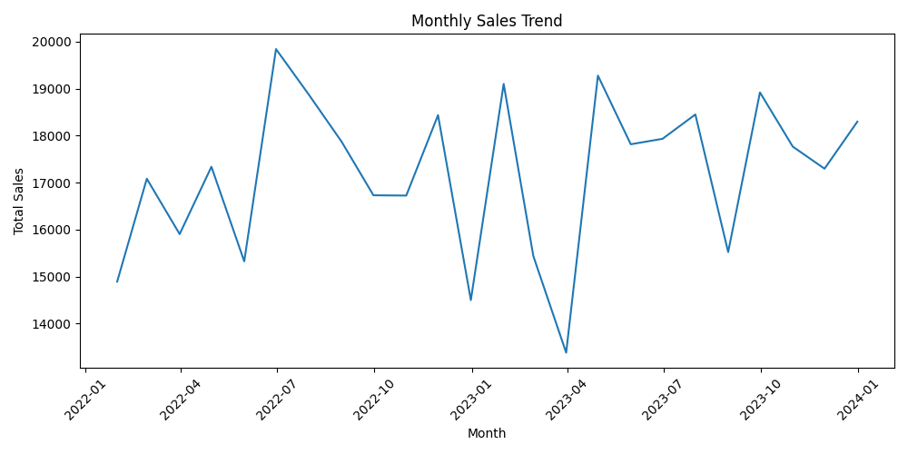
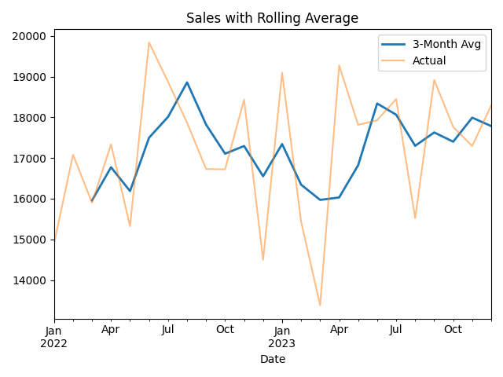

# 📊 Sales Trend Analysis with Python

This project demonstrates **time-series trend analysis** using **Pandas, Seaborn, and Matplotlib**.  
We analyze sales data, resample it by month, and visualize both the **monthly sales trend** and a **rolling average**.

---

## 📂 Dataset
The dataset (`sales_data.csv`) contains two columns:
- `Date` → Daily dates (2022–2023)
- `Sales` → Simulated daily sales values

---

## 🚀 How to Run
1. Clone this repository:
   ```
   git clone https://github.com/S00RAJVS/sales-analysis-python.git
   cd sales-analysis-python
   ````


2. Install dependencies:

   ```
   pip install pandas matplotlib seaborn
   ```

3. Run the script:

   ```
   python trend_analysis.py
   ```

4. The script generates plots and saves them as images in the `images/` folder:

   * `monthly_sales_trend.png`
   * `sales_with_rolling_avg.png`

---

## 📈 Monthly Sales Trend



---

## 📊 Sales with Rolling Average



---

## 🛠 Tools Used

* Python 🐍
* Pandas
* Seaborn
* Matplotlib

---

## 👤 Author

Sooraj VS
